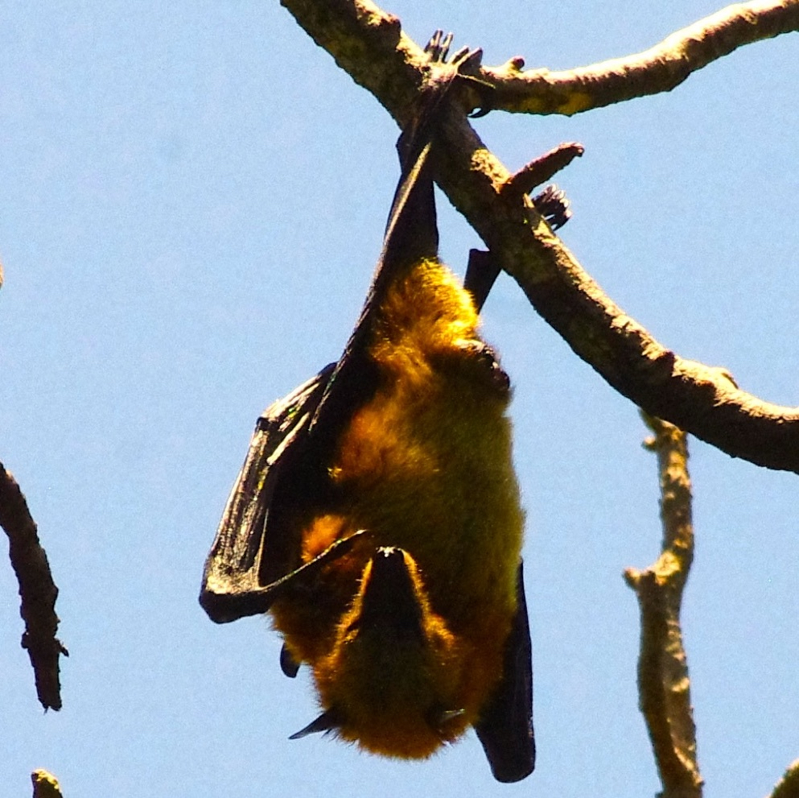

<em>A year-long mentorship program in R-based data analysis and communication for Malagasy students with ongoing research projects in ecology, conservation, biodiversity science, and related fields which runs from May 2022 to April 2023.</em>

🛑 Deadline: Friday, April 1, 2022 at 11:59 pm US Central Time

 

We are pleased to announce our National Geographic-funded year-long mentorship program, Coding for Conservation, to be held from May 2022-April 2023. This program is targeted towards Malagasy students in their third cycle or higher in conservation biology, zoology, animal biodiversity, entomology, botany, and related fields, though <strong>all are welcome to apply</strong>. In part with this program, Malagasy students will attend a mix of remote (online) and in-person lectures and tutorials on an <em>every-other-week frequency</em> while also receiving <em>one-on-one instruction</em> in data analysis and scientific writing oriented towards the publication of their personal research projects. Funding will be provided for students to procure data to attend online workshops, and opportunities will be available for students based in Antananarivo to view lectures in a group setting.

Students will receive general instruction in the analysis and modeling of ecological data in a series of interactive lectures and computer-based tutorials using the open-source software R and learn to fine-tune research questions and develop clear analytical frameworks. <!-- A preliminary outline of our planned instructional series is available here: link??? //--> Attendance and participation in all lessons and tutorials will be mandatory.

Additionally, students will be assigned a one-on-one instructor mentor to guide them personally in analysis and write-up of their own data over the course of the year, with the goal of submitting the work for eventual publication. We are specifically interested in selecting students with ongoing research projects and existing datasets who seek additional support in data analysis and writing a manuscript for publication. 

The course will be taught primarily in English, though a subset of the faculty will be available to offer some translation into French and/or Malagasy. A working knowledge of the English language is required for admission; however, we will do our best to make the material accessible to students who find English challenging. If you have any questions about the appropriateness of your background or training for our course, either in language or in science, please do not hesitate to contact us straight away (email below).

Applications are available for submission at below and must be completed and uploaded by 11:59 pm US Central Time on <strong>Friday, April 1, 2020</strong> if you wish to be considered.

All application materials must be submitted in English. The application consists of:

<ul>
	<li>Form linked here: [AIRTABLE LINK GOES HERE]</li>
	<li>Uploaded .pdf file with:
		<ul>
			<li>Curriculum Vitae (Limit: 4 pages).</li>
			<li>Research Abstract. <em>Please describe your ongoing research project and the data you wish to analyze in conjunction with this program in detail. (Limit: 250 words).</em></li>
			<li>Statement of Interest and Intent. <em>Please describe why you are interested in this program and what you will gain from the experience. (Limit: 500 words).</em></li>
		</ul>
	</li>
</ul>

Please do not hesitate to contact us at <a href="mailto:questions@coding4conservation.org">questions@coding4conservation.org</a> with any questions or concerns. We hope to see your application in April!

–The ‘Coding for Conservation’ steering committee 
<em>Cara Brook, Onja Razafindratsima, Emily Ruhs, Theresa Laverty, Angelo Andrianiaina, Fifi Ravelomanantsoa, Santino Andry, Dominic Daniels, Kendall Fitzgerald, Benjamin Chait, Hafaliana Christian Ranaivoson</em>

